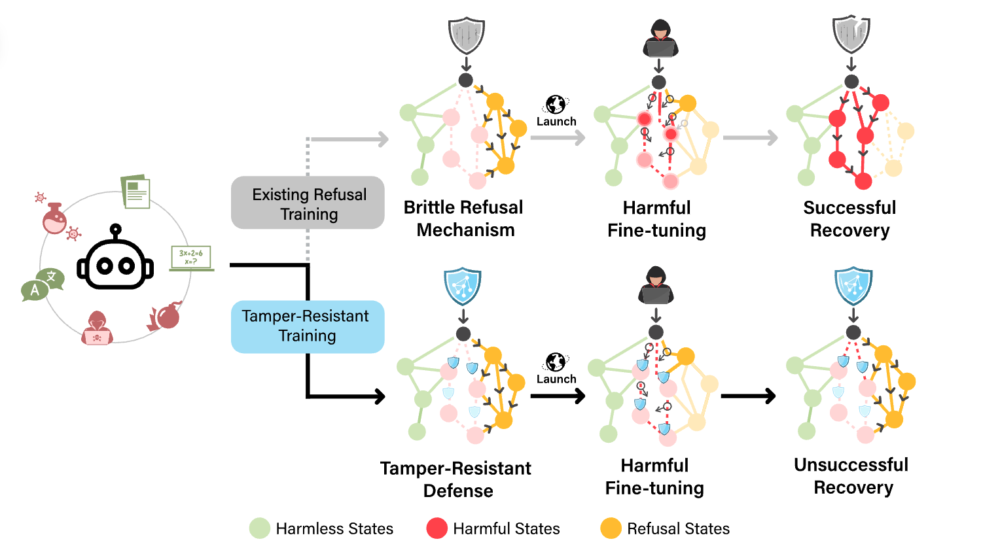

# 🛡️ Tamper-Resistant Safeguards for Open-Weight LLMs 🤖




We introduce a novel method, Tampering Attack Resistance (TAR), which is the first defense to withstand a significant number of open-weight fine-tuning attacks on LLMs, while preserving model capabilities.


## Table of Contents

- [📰 Latest News 📰](#Latest-News)
- [🛡️ What are Tamper-Resistant Safeguards? 🛡️](#What-are-Tamper-Resistant-Safeguards)
- [🌐 Overview 🌐](#Overview)
- [☕ Quick Start ☕](#Quick-Start)
  - [⚙️ Installation](#Installation)
  - [🛠️ Running Tamper-Resistance Training](#Running-Tamper-Resistance-Training)
  <!-- - [➕ Running the Red-teaming evaluation](#Red-teaming-evaluation) -->
- [📁 Directory Structure](#Directory-Structure)
- [🤗 Models and Datasets](#Models-and-Datasets)
- [🙏 Citation 🙏](#Citation)

## 📰 Latest News 📰

* ***[2024/08/07] 🚀 TAR 1.0: 🤗 Huggingface models, red-teaming evaluation + baselines code, and other improvements*** 🚀
* ***[2024/08/01] 🚀 [Initial release of TAR](https://github.com/rishub-tamirisa/tamper-resistance)*** 🚀

## 🛡️ What are Tamper-Resistant Safeguards? 🛡️

Tamper-Resistant Safeguards are security measures designed for open-weight large language models (LLMs) to protect against malicious modifications of the model's weights. Unlike traditional safeguards that focus on preventing input-based attacks, these advanced safeguards prevent adversaries with access to full model weights from recovering performance on harmful capabilities. We demonstrate in our extensive red-teaming evaluation that Tamper-Resistant Safeguards created via TAR are the first to be robust to a significant number of open-weight fine-tuning attacks.

## 🌐 Overview 🌐

This repository contains implementations for TAR (including the Random Mapping initial safeguard), red-teaming evaluation, and baseline methods. The current implementation assumes that models from 🤗 Transformers, meaning they have the expected configs, subclasses, etc. However, in principle the FSDP wrapping can be made compatible with any model. We plan to update the code to be more agnostic when we migrate to FSDP v2.

## ☕ Quick Start ☕

### 📦 Setup

1.  Clone and enter the repository:
    ```bash
    git clone https://github.com/rishub-tamirisa/tamper-resistance.git
    cd tamper-resistance
    ```

2. Install dependencies:
    ```bash
    pip install -r requirements.txt
    ```

3. Setup the dotenv (`.env`):
    - In the root level of the repository, create a `.env` file following the format of the included `dotenv` file.
    - We've already included the FSDP configs used for running the method in the `configs` folder. You can use these or create your own. For running TAR with FSDP v1, it's important that `fsdp_use_orig_params=false` and `fsdp_sharding_strategy=1`.
    - Finally, set the environment variables:
      ```bash
      source .env
      ```


> [!CAUTION]
> Do not push your `.env` file to a public repository. Since it contains your Huggingface token and other secrets, it could lead to unauthorized access to your Huggingface account. We've already included it in the `.gitignore` file to prevent this.
  

### 📁 Directory Structure

`tar.py` serves as the main entrypoint for running the TAR method. It uses python modules in the `modules` folder. Example usage is provided in the `run_tar_bio.sh` and `run_tar_cyber.sh` scripts.

The `modules` folder contains the following files:
- `baselines.py`: Entrypoint for running baseline methods
- `dataloaders.py`: Dataloader implementations
- `objectives.py`: Objective / loss function implementations
- `fsdp_v1_utils.py`: Utilities for FSDP v1
- `training.py`: All training loop implementations, including TAR
- `utils.py`: Helper functions
 


### 🛠️ Running Tamper-Resistance Training

We provide scripts in the root-level folder for running TAR for biosecurity and cybersecurity: `run_tar_bio.sh` and `run_tar_cyber.sh`.


It's recommended to run Llama-3-8B-Instruct models (or similar size) on systems with `8xA100 80G` or more VRAM due to full-parameter training and other overheads introduced by the first-order meta-learning implementation. 

Note: the code is currently untested on multi-node environments, we expect to support this upon migration to the [recently released `FSDP2` from PyTorch 2.4](https://pytorch.org/blog/pytorch2-4/#prototype-fsdp2-dtensor-based-per-parameter-sharding-fsdp).

With the appropriate GPU setup, and assuming the `.env` is correctly set, simply run:

```bash
sh run_tar_bio.sh
```

<!-- ### ➕ Running the Red-teaming evaluation -->

## 🤗 Models and Datasets

We release models and datasets used to replicate the Bio and Cyber experiments in our paper here: [🤗 Huggingface Collection](https://huggingface.co/collections/lapisrocks/tamper-resistant-safeguards-for-open-weight-llms-66b2dc4cc40442c79ec890a5).

## Citation

If you find this repository useful in your research, please consider citing our paper:

```
@misc{tamirisa2024tamperresistantsafeguardsopenweightllms,
      title={Tamper-Resistant Safeguards for Open-Weight LLMs}, 
      author={Rishub Tamirisa and Bhrugu Bharathi and Long Phan and Andy Zhou and Alice Gatti and Tarun Suresh and Maxwell Lin and Justin Wang and Rowan Wang and Ron Arel and Andy Zou and Dawn Song and Bo Li and Dan Hendrycks and Mantas Mazeika},
      year={2024},
      eprint={2408.00761},
      archivePrefix={arXiv},
      primaryClass={cs.LG},
      url={https://arxiv.org/abs/2408.00761}, 
}
```
